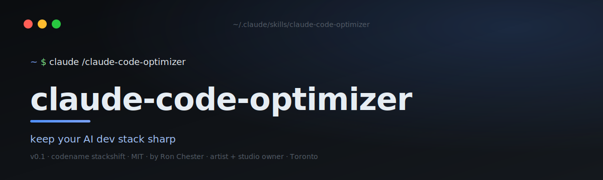

<p align="center">
  
</p>

# claude-code-optimizer

> **Codename:** stackshift &middot; **Version:** 0.1 &middot; **Author:** [Ron Chester](https://github.com/ronchestermusic) — artist · studio owner · building tools for the music business · Toronto

A Claude Code skill that audits your AI dev stack, hunts down new plugins / skills / MCP servers worth installing, asks before changing anything, installs what you approve, and prints a dated PDF report to your Desktop.

**Run it once a month. Keep your stack sharp.**

---

## ⌘ &nbsp; Install

```bash
mkdir -p ~/.claude/skills/claude-code-optimizer
curl -o ~/.claude/skills/claude-code-optimizer/SKILL.md \
  https://raw.githubusercontent.com/ronchestermusic/claude-code-optimizer/main/SKILL.md
```

Then in any Claude Code session:

```
/claude-code-optimizer
```

Or just say *"optimize my Claude Code setup"* — the skill auto-triggers.

---

## ⚡ &nbsp; What it does

```
┌─ STEP 1 ─────────────────────────────────────────┐
│  AUDIT     →  scan installed plugins + MCPs      │
├─ STEP 2 ─────────────────────────────────────────┤
│  RESEARCH  →  marketplace, awesome-lists, MCPs   │
├─ STEP 3 ─────────────────────────────────────────┤
│  COMPARE   →  flag overlap, evaluate fit         │
├─ STEP 4 ─────────────────────────────────────────┤
│  ASK       →  nothing installs without approval  │
├─ STEP 5 ─────────────────────────────────────────┤
│  INSTALL   →  run the right `claude` commands    │
├─ STEP 6 ─────────────────────────────────────────┤
│  REPORT    →  warm cream PDF on your Desktop     │
└──────────────────────────────────────────────────┘
```

---

## 📄 &nbsp; What's in the PDF

- Cover page with the date and a summary of what changed
- One section per newly installed tool — what it does in plain English, how to use it
- A "skipped" section explaining what was looked at and why it didn't make the cut
- An updated quick-reference table of your full stack
- Tips bar at the bottom of every page

Saved as `claude-code-update-YYYY-MM-DD.pdf` on your Desktop.

---

## 🛠 &nbsp; Requirements

| Need | Why |
|---|---|
| [Claude Code](https://claude.com/claude-code) | the host |
| macOS | PDF generation uses Chrome headless (Linux/Windows users can adapt) |
| Google Chrome | at `/Applications/Google Chrome.app` |

---

## 💭 &nbsp; Why I built it

I'm an artist and studio owner in Toronto building tools for the music business. Claude Code is the spine of how I work — sketching releases, automating studio admin, prototyping ideas for other artists.

But new plugins ship weekly. New MCP servers ship weekly. Tracking all of it is a part-time job nobody asked for.

So I built a skill that does the tracking for me, on a schedule I control, with **receipts** (the PDF) so I remember what I added and why.

---

## 📜 &nbsp; License

MIT. Use it, fork it, ship your own version.

---

<sub>Built by **[Ron Chester](https://github.com/ronchestermusic)** &middot; artist + studio owner shipping music-industry tools &middot; Toronto &middot; If this saved you an afternoon, ⭐ the repo.</sub>
